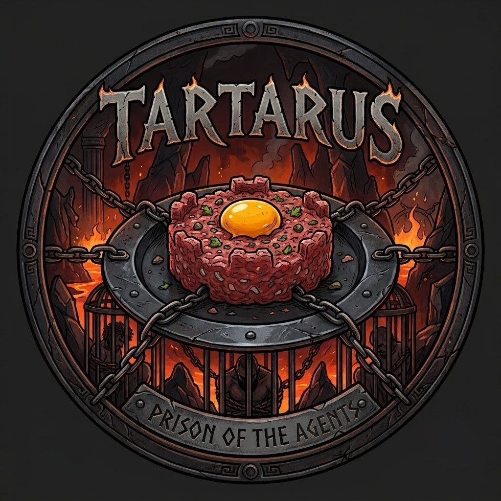

  
  <h1>tartarus environment</h1>
  
infrastructure-as-code isolated environment for ai agents and golang development

---

## architecture & stack
* **hypervisor:** orbstack (macos m-series optimized).
* **base image:** debian 12 (bookworm) + golang 1.23.
* **runtimes:** python 3.11, node.js 22 lts.
* **ai tooling:** opencode-ai, aider-chat, uv (python package manager).
* **isolation level:** strictly sandboxed. container has zero access to the macos filesystem outside the `./workspace` directory.

## orbstack setup requirements
1. install orbstack: `brew install orbstack`
2. **critical security step:** open orbstack gui -> settings -> file sharing -> **remove all default mounts (including `~`)**. tartarus manages its own strict mounts via docker cli.

## lifecycle management (makefile)
use the provided `Makefile` to control the environment.

| command | description |
|---|---|
| `make env` | scaffolds `.env`, `workspace/`, and `configs/` directories. |
| `make build` | compiles the minimal debian docker image. |
| `make start` | runs the container in daemon mode. binds ports, envs, and mounts. |
| `make stop` | kills and destroys the container (workspace files remain safe). |
| `make restart` | executes stop -> start. **required to reload changes made to `.env`**. |
| `make init` | executes one-time internal setup (zsh, locales, opencode, aider). |

## access & monitoring
| command | description |
|---|---|
| `make zshell` | drops you into the container with a fully configured zsh environment. |
| `make logs` | tails the background daemon output. |
| `make status` | opens live htop-like view of cpu/ram consumption via docker stats. |
| `make check-sec`| verifies that the mac filesystem is inaccessible from inside. |

## networking & port management
tartarus is configured with an explicit **port block** to allow autonomous agents to serve web applications without requiring container restarts.

* **host to container:** ports `8000-8010` inside the container are explicitly mapped to `18000-18010` on the mac.
  * *example:* instruct your ai agent to start a go fiber server on port `:8080`. access it on your mac at `http://localhost:18080`.
* **container to host:** to access local mac services (e.g., local postgres, ollama, lmstudio) from inside tartarus, use the internal dns routing: `host.orb.internal`.
  * *example:* `curl http://host.orb.internal:11434/api/tags`

## environment variables & secrets
secrets are strictly injected into process memory at runtime via `--env-file`.
1. edit `.env` on your mac.
2. run `make restart` to inject new variables.
3. variables are accessible internally as standard linux env vars (`$OPENAI_API_KEY`).

## configurations (ssh & git)
do not mount your personal mac `~/.ssh`.
1. place dedicated private keys inside `./configs/ssh/`.
2. edit `./configs/gitconfig`.
3. the makefile mounts these as strictly **read-only (`:ro`)** into `/root/.ssh` inside the container. the ai agent can clone repositories but cannot modify your credentials.

## workflow example (autonomous ai coding)
1. start environment: `make start`
2. enter tartarus: `make zshell`
3. launch agent: `aider --model deepseek/deepseek-coder`
4. prompt: *"create a golang rest api in /workspace/app using fiber. run the server on port 8000."*
5. test from mac: open `http://localhost:18000`
